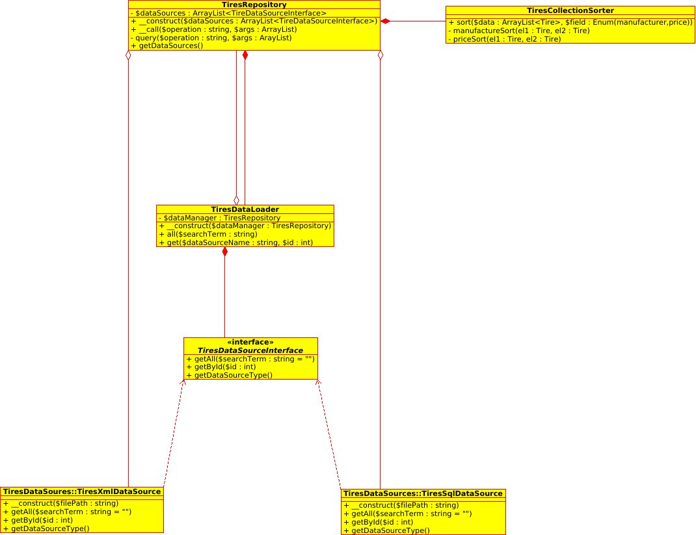
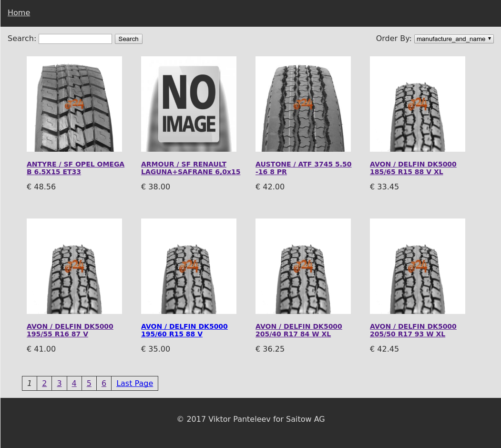
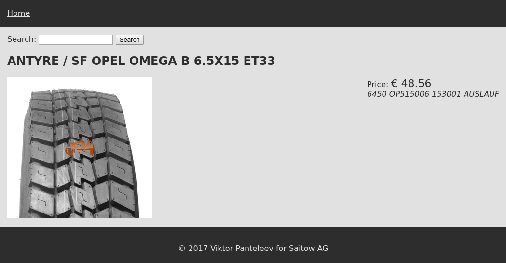

# Saitow Test - Tasks

## Sketch a Class Diagram for a module which fetches the data and normalizes it

The diagram bellow implements two data sources: *TiresSqlDataSource* and *TiresXmlDataSource*

## Plan the Unit tests

### DataSources Tests

The tests are implemented in **src/tests/unit/TiresSqlDataSourceTest.php** and **src/tests/unit/TiresXmlDataSourceTest.php**

- test to fetch all items, without filter
- test to fetch all items, with serach filter
- test to fetch a single item

### DataLoader Tests

The tests are implemented in **src/tests/unit/TiresDataLoaderTest.php**

- test loading all data from 2 data sources
- test loading single item from one of the data sources

### Collection Sorter Tests

The tests are implemented in **src/tests/unit/TiresCollectionSorterTest.php**

- sort products by Title (Name, or in my case: Manufacturer / Name)
- sort products by Price

### Paginator Tests

The tests are implemented in **src/tests/unit/PaginatorTest.php**

*Given we have 66 products and can display only 10 per page and we show 2 pages before and after the current one, test the following:*

- Paginator links for when we are on the 2nd page
- Paginator links for when we are on the 1st page
- Paginator links for when we are on the last page (7th).

## Create a Block diagram (flowchart) for the Controller

## Design a simple UI for the product page

The UI is developed using Twig. the twig fiels are located in **src/templates/**

## Implement the models and the controller

- The website consists of only one model **src/app/Model/Tire.php**
- The website consists of only one controller **src/app/Controller/HomeController.php**

## Create a sample working search page and a detail page

- Search page: http://[website_url]/search/Goodyear (docker: http://172.17.0.2/search/Goodyear)
- Item pages: http://[website_url]/item/sql_2116 (docker: http://172.17.0.2/item/sql_2116) or http://[website_url]/item/xml_2 (docker: http://172.17.0.2/item/xml_2)